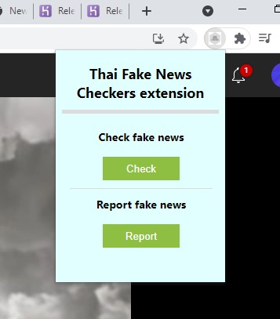
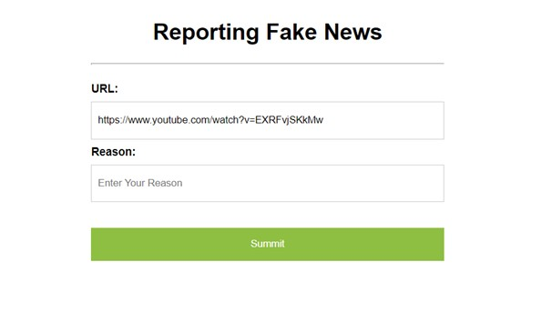

# fake-news-chrome-extension
Thai Fake News Checker is a chrome extension that let you easily check the news by using fake and real Thai news dataset from the Thai Government agency's website that provide only news that already have been confirmed. The webiste: https://www.antifakenewscenter.com 
 
## Installation
- Clone or download this repository into empty folder.
- Open chrome extension page and enable developer mode on the top right corner.
- Click "Load unpacked" and select the extension folder

  

## Doc
In this extension, there are three main function, including check the news, report the news and get the score of the website.
The score calculated from every time a user use check the news function if the news is real, the score will be 3 and 1 if the news is fake and using weigh average formula to calcurate the final score.
  

### Checking News

You can check the news by navigate to the Thai news article page and click on the check news button like in this picture: 

 

  

  
 
After you clicked the button, you have to wait for the extension to work which have average working time around 10 - 20 seconds, you will get the result as an alert, then if the news is fake or real, the extension will navigate user to the matching Government agency website page for references.

 

- Result as fake news 

  

 

- Result as real news 

  

 

- Cannot find a matching news

  

 

### Reporting News

If user find a news fake news that our extension do not classify it as such, user can report the news by clicking the report news button.
Then the extension will navigate users to the reporting page, and user can summit the reason or the evidence which make users believe that the news is fake.

 

  

   

### Website Score

Every time user change or refresh a page the extension will get the weigh average score from the database of the current website and display it as an icon color. 

- grey: if the website have not been rated yet.
- red: the website's news have been rated as a fake news a lot.
- yellow: the website's news have been rated eqully between fake and real news.
- green: the website's news have been rated as a real news a lot.

   

  
  
  
  

 

## Noted
In this project, it doesn’t have updating tf-idf model process, that’s mean the if there is an update in fake news and real news database, matching algorithm will not be accurate. And due to our extension aim to be simple and easy-to-use as much as possible, we decide to get the headline of the text by using h1 and h2 html tags which can handle most Thai news website, but still not be able to handle on every Thai news website.

 

## Alert Box

We use CuteAlert by gustavosmanc to help us alert the result to the user.
 
Credit: from gustavosmanc Link: https://github.com/gustavosmanc/cute-alert
